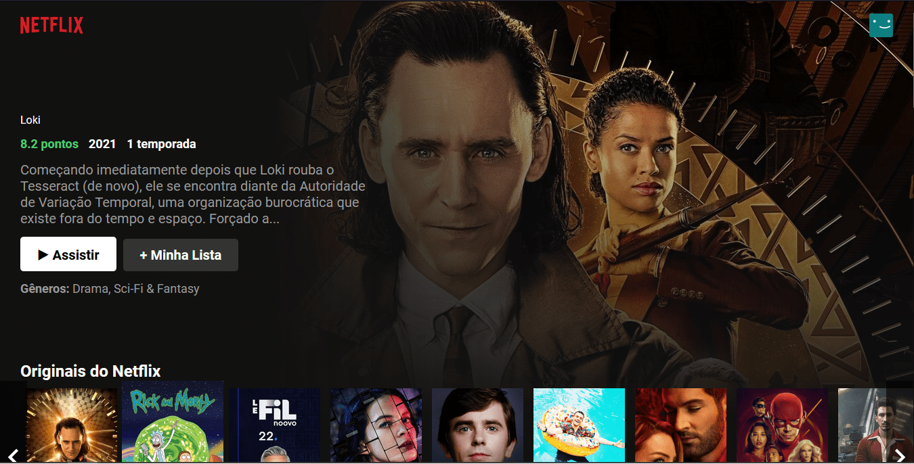

# Netflix UI Clone with React

<h1 align="center">
    
</h1>

This is a netflix clone, which means there is no real functionality, other than showing the front page with its featured movie and movie lists separated by theme.

## 🧪Technologies
- [React](https://reactjs.org)
- [TypeScript](https://www.typescriptlang.org/)

## 💨 Running the Project

- Clone the project and run `yarn` to install the dependencies;
- Create an account at [TheMovieDB](https://www.themoviedb.org/);
- Add the api_key to your .env (rename .env.example and fill the variables there);
- Run the project with `yarn start`;

## ❕ Additional Details
- This project was a youtube code-along by [B7Web](https://www.youtube.com/watch?v=tBweoUiMsDg);
- My modifications start after commit #85d03c0;

## 👨‍💻 Possible Improvements
- ~~Move components into their own folders;~~
- ~~Add Typescript;~~
- Add code standard with ESLint and Prettier;
- Fix responsiveness for some edge cases;
- Save the data on local storage for a period of time (e.g. a few hours), so that we don't flood the API on every page refresh;
- Add the possibility to toggle between PT-BR and EN, and show a button for that on the header;
- Don't show movies on "featured" that have no poster image;
- Add Styled Components;
- Switch to relative sizes on css, to make responsiveness more organic;

This project was bootstrapped with [Create React App](https://github.com/facebook/create-react-app)